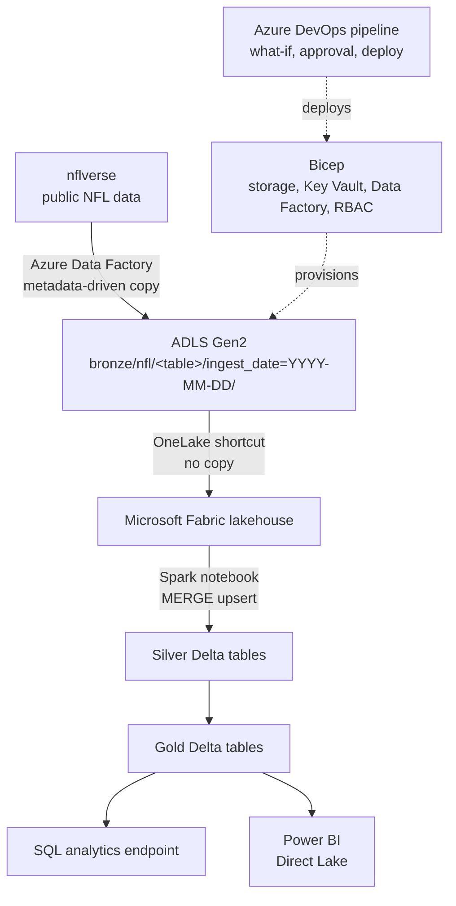
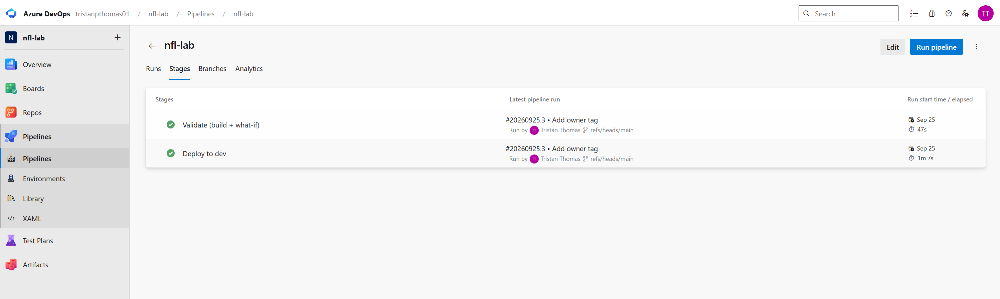
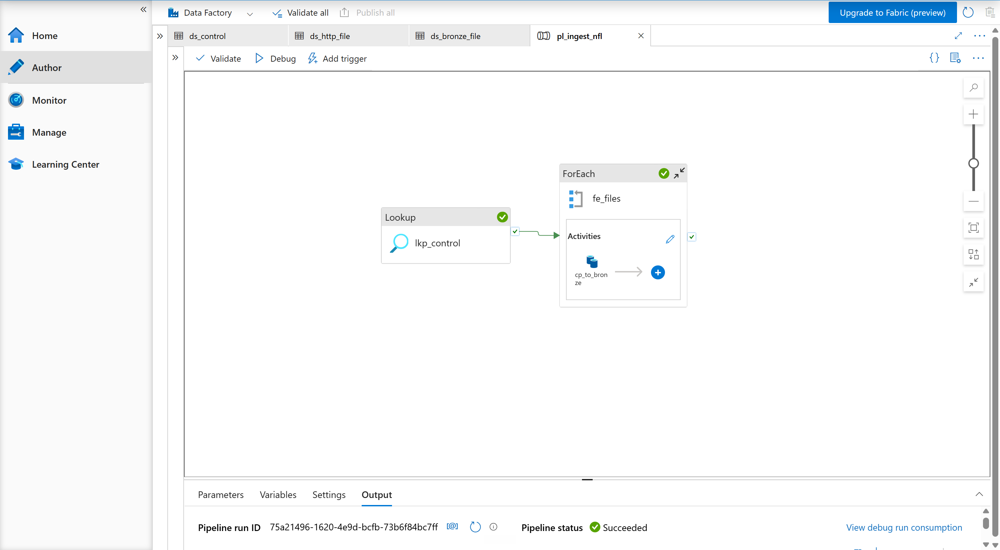
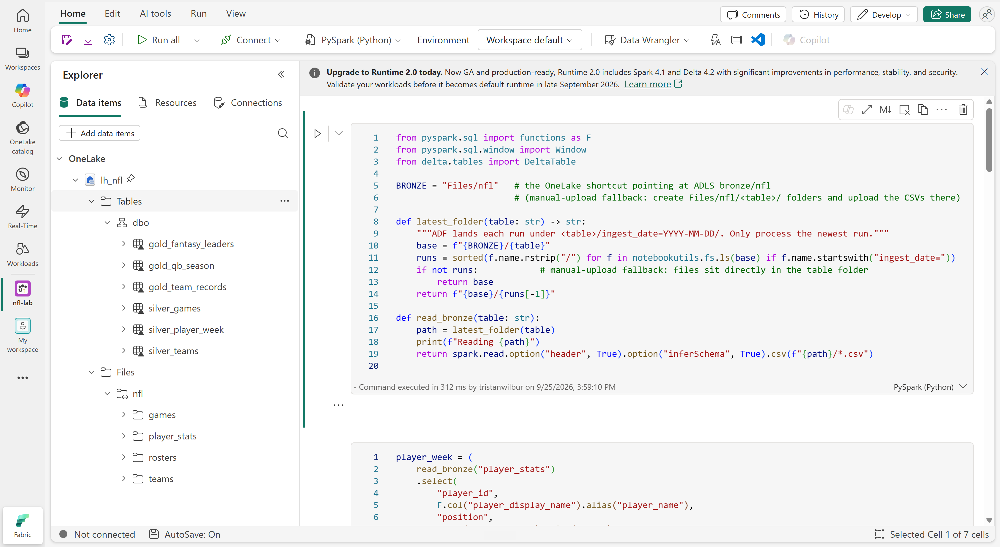
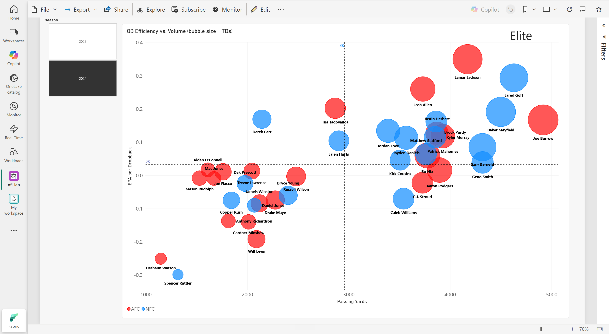

# NFL data platform on Azure and Microsoft Fabric

A small data platform I built end to end on Azure. The infrastructure is written in Bicep and deployed through Azure DevOps. Data Factory pulls public NFL data into a data lake, and a Fabric lakehouse turns it into Delta tables and a Power BI report.

My paid data engineering work has been on Databricks, Spark, and Snowflake. I hadn't used Data Factory, Fabric, or Bicep on a client, so I built this to learn them properly. I picked NFL data because it's more fun to check than a sample sales database: I know what the right answer looks like.

## How it fits together



Data Factory copies CSV files from nflverse into the `bronze` container of an ADLS Gen2 account, in a dated folder for each run. The Fabric lakehouse reads that folder through a OneLake shortcut, so the files aren't copied a second time. A Spark notebook builds three silver and three gold Delta tables. The SQL analytics endpoint and a Direct Lake Power BI model both read those tables directly.

The storage account, Key Vault, Data Factory, and the role assignments between them all come from one Bicep template, which an Azure DevOps pipeline deploys.

## What's in the repo

```
infra/
  main.bicep                   Storage, Key Vault, Data Factory, and the role assignments
  main.dev.bicepparam          Parameters for the dev environment
azure-pipelines.yml            Validate and deploy pipeline for the Bicep
adf/
  control.csv                  One row per source file to ingest
  pipeline/ dataset/ linkedService/   Data Factory definitions, copied out of the factory
fabric/
  nb_nfl_bronze_to_gold.py     Spark notebook: bronze to silver to gold
  sql_endpoint_queries.sql     T-SQL queries against the SQL analytics endpoint
docs/                          Screenshots
```

## Infrastructure and access

I wanted the pipelines to run without a key or password stored anywhere, so every connection uses an identity and a role assignment in the Bicep:

- Data Factory writes to the lake as its system-assigned managed identity. It has Storage Blob Data Contributor on the storage account and nothing wider.
- The same identity has Key Vault Secrets User on the vault. Nothing uses it yet, because nflverse is public. It's there for a source that needs a password.
- My Fabric user has Storage Blob Data Reader, which is what the shortcut reads with.
- The DevOps pipeline signs in with workload identity federation, so DevOps holds no client secret.

One caveat: shared key access is still switched on for the storage account, and I used it to upload the control file from the portal. Turning it off is on the list at the bottom.

The pipeline's own permissions took the most thought. Its service connection gets Contributor on the resource group, and Contributor can't create role assignments, which this template does three times. Making it Owner would work, but then it could grant any role to anyone. I gave it Role Based Access Control Administrator with a condition that limits it to assigning the three roles above.

## Deployment pipeline

`azure-pipelines.yml` has two stages. Validate builds the Bicep and runs `what-if`. Deploy runs only on `main` and waits for an approval on the `nfl-dev` environment. The pipeline triggers only when something under `infra/` changes.

Two things I learned from running it:

- The first run validated and then skipped the deploy. My first push had created a `master` branch, and the deploy condition only allows `main`. The condition was right, so I renamed the branch.
- After a clean deploy, `what-if` still lists six resources as "modify". None of those are real changes. They're defaults Azure fills in that the template doesn't declare, plus a managed identity ID that `what-if` can't resolve ahead of time. Redeploying changes nothing.



## Ingestion

`pl_ingest_nfl` is one pipeline for every source. A Lookup reads `control.csv`, a ForEach loops over its rows four at a time, and a Copy activity lands each file in `bronze/nfl/<table>/ingest_date=YYYY-MM-DD/`. Adding a source means adding a row to the control file. A `season` parameter fills the `{season}` placeholder in each path, which is how I loaded 2023 after 2024 without changing the pipeline.

Files are copied as binary, with no parsing, and each run gets its own dated folder. That means I can rebuild silver and gold from bronze without going back to the source.

What went wrong while I built it:

- The ForEach failed with "the function 'length' expects an array". I had pointed it at the Lookup's whole output instead of `output.value`. The activity's output JSON made that obvious.
- An expression pasted with a space in front of the `@` is saved as plain text, so the bronze folder would have been named after the expression itself.
- The file name comes from `split(item().relative_url, '/')[1]`. That only works because every path in the control file is exactly one folder deep.



## Lakehouse

`fabric/nb_nfl_bronze_to_gold.py` reads the newest `ingest_date` folder for each table and builds these:

| Table | Layer | Contents |
|---|---|---|
| `silver_player_week` | Silver | One row per player per week, typed and deduplicated |
| `silver_teams` | Silver | Team reference data |
| `silver_games` | Silver | One row per game played |
| `gold_qb_season` | Gold | Quarterback season totals with EPA per dropback, joined to teams |
| `gold_fantasy_leaders` | Gold | PPR points with a rank within each position (WR1, RB12, and so on) |
| `gold_team_records` | Gold | Standings, built by turning each game into one row per team |

Player stats load with a Delta `MERGE` on player, season, week, and season type. Rerunning the notebook doesn't duplicate rows, and loading another season leaves the existing ones alone. Teams (36 rows) and games (a few thousand) are small enough that I overwrite them on every run.

I checked the output against the real 2024 season. Lamar Jackson leads quarterbacks in EPA per dropback, Ja'Marr Chase is WR1, and the Lions and Chiefs both finish 15–2.





## What isn't done

- Rosters are copied to bronze, but nothing reads them yet.
- The player stats files stop at 2024. nflverse publishes later seasons in a different release with three renamed columns, so adding 2025 means changing one row in the control file and three column mappings in the silver load.
- The gold tables don't share a season or team dimension, so a slicer in the report only filters the table it was built on.
- There's no trigger on the Data Factory pipeline. I run it by hand.
- Data Factory was built in the studio, not from Git. The JSON in `adf/` is a copy of what's deployed.
- The notebook lets Spark infer the CSV schema, and the only checks are the ones I did by eye.

## What I'd add for a real client

- Private endpoints on the storage account and Key Vault, and shared key access turned off.
- A prod parameter file and a second environment with its own approval.
- Git integration for Data Factory and Fabric, so they deploy the same way the infrastructure does.
- Checks between bronze and silver: row counts, nulls in the key columns, and a schema check, so a renamed column fails the load instead of filling it with nulls.
- Alerts on failed pipeline runs.

## Running it yourself

You need an Azure subscription, the Azure CLI, and a Fabric workspace.

```bash
# 1. Create the resource group
az group create --name rg-nfl-lab-dev --location eastus

# 2. Put your Entra user's object ID in infra/main.dev.bicepparam (fabricUserObjectId)
az ad user show --id <you>@<tenant>.onmicrosoft.com --query id -o tsv

# 3. Preview, then deploy
az deployment group what-if --resource-group rg-nfl-lab-dev --parameters infra/main.dev.bicepparam
az deployment group create  --resource-group rg-nfl-lab-dev --parameters infra/main.dev.bicepparam
```

Then:

1. Upload `adf/control.csv` to the `config` container.
2. Create the linked services, datasets, and pipeline from the JSON in `adf/`. Change the URL in `ls_adls.json` to your storage account first. Run `pl_ingest_nfl` with a season, for example `2024`.
3. In Fabric, create a lakehouse, add a shortcut to the `bronze/nfl` folder, and run the cells in `fabric/nb_nfl_bronze_to_gold.py`.
4. Query the gold tables with `fabric/sql_endpoint_queries.sql`, or build a Direct Lake semantic model on them.

For the DevOps pipeline, create a service connection named `sc-nfl-lab` with workload identity federation, scoped to the resource group, and give it the constrained role described above.

## Data source

The data comes from [nflverse](https://github.com/nflverse/nflverse-data), a public dataset maintained by its community.
