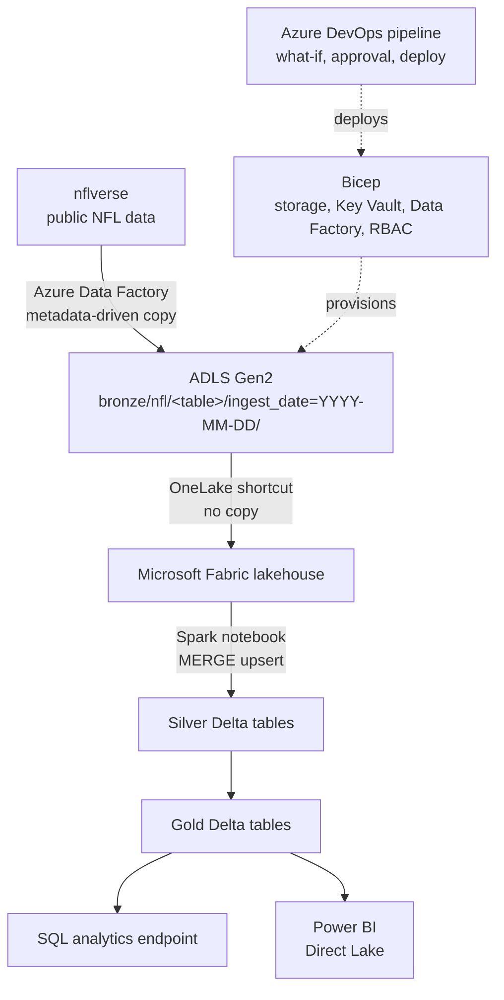

# NFL Data Platform on Azure and Microsoft Fabric

An end-to-end data platform built on Azure, from infrastructure to dashboard, using public NFL data as the source. Everything is provisioned as code, deployed through a CI/CD pipeline with an approval gate, and secured without a single stored key or password.

I built this as a personal project to work hands-on with the Azure-native stack. My professional data engineering work has been on Databricks, Spark, and Snowflake; this project applies the same patterns (medallion layers, idempotent loads, parameterized pipelines) with Bicep, Azure DevOps, Data Factory, and Fabric.

## Architecture



| Layer | Tool | What it does |
|---|---|---|
| Infrastructure | Bicep | Defines the data lake, Key Vault, Data Factory, and every permission |
| CI/CD | Azure DevOps Pipelines | Validates the Bicep, previews changes with what-if, waits for approval, deploys |
| Ingestion | Azure Data Factory | One parameterized pipeline loads every source listed in a control table |
| Storage | ADLS Gen2 | Raw files land in bronze, in a dated folder per run |
| Transformation | Fabric lakehouse, Spark | Builds silver and gold Delta tables |
| Serving | SQL analytics endpoint, Power BI | Query and report on the same Delta tables, with no extra copy |

## What's in this repo

```
infra/
  main.bicep                   Storage, Key Vault, Data Factory, and RBAC role assignments
  main.dev.bicepparam          Parameters for the dev environment
azure-pipelines.yml            CI/CD pipeline (Microsoft-hosted agent)
azure-pipelines.windows.yml    The same pipeline for a self-hosted Windows agent
adf/
  control.csv                  Control table: one row per source file to ingest
  pipeline/ dataset/ linkedService/   Data Factory definitions, exported from the factory
fabric/
  nb_nfl_bronze_to_gold.py     Spark notebook: bronze to silver to gold
  sql_endpoint_queries.sql     T-SQL queries against the SQL analytics endpoint
docs/                          Screenshots
```

## Design decisions

### No keys, no passwords

There is no stored secret anywhere in this build.

- Data Factory writes to the lake with its **system-assigned managed identity**.
- Fabric reads the lake with an **Entra user identity**.
- The DevOps pipeline signs in to Azure with **workload identity federation**, so there is no client secret to expire or leak.
- Every permission is an **RBAC role assignment written in Bicep**, so access changes are reviewed like any other code change.

### A pipeline identity that can only do what the template needs

The default Contributor role can create resources but cannot create role assignments, and this template contains three. The common fix is to make the pipeline an Owner, which would let it grant any role to anyone. Instead, the pipeline identity has a **constrained Role Based Access Control Administrator** role that can assign only the three roles the template uses: Storage Blob Data Contributor, Storage Blob Data Reader, and Key Vault Secrets User.

### Preview before every deployment

The pipeline has two stages:

1. **Validate** compiles the Bicep and runs `what-if`, which shows exactly what would be created, changed, or deleted.
2. **Deploy** runs only from `main`, and only after a person approves it on the `nfl-dev` environment.

Running the deployment a second time reports no changes, which confirms the template is idempotent.


### One ingestion pipeline for every source

The Data Factory pipeline `pl_ingest_nfl` is metadata-driven:

`Lookup (control.csv)` → `ForEach row (in parallel)` → `Copy file to bronze`

- **Adding a source means adding a row** to the control file, not building another pipeline.
- A `season` parameter fills a placeholder in each source path, so the same pipeline loads or backfills any season.
- The source and sink datasets are parameterized, so one pair of datasets serves every table.
- Copies retry twice before failing.


### Bronze is raw and never overwritten

Files are copied byte for byte, with no parsing, into `bronze/nfl/<table>/ingest_date=YYYY-MM-DD/`. Every run lands in its own dated folder, so earlier loads are kept and silver and gold can always be rebuilt from bronze without going back to the source.

### Fabric reads the lake in place

The Fabric lakehouse uses a **OneLake shortcut** to the bronze container instead of copying the data. There is one copy of the data and no sync job to maintain.

### Loads that are safe to rerun

The Spark notebook picks its load strategy by table:

- **Player stats (the large table):** a Delta `MERGE` keyed on player, season, and week. Rerunning the load creates no duplicates, and loading another season adds rows without touching the existing ones.
- **Small reference tables (teams, games):** a full overwrite, because a merge is unnecessary for a few dozen rows.
- **Incremental by default:** the notebook processes only the newest `ingest_date` folder.

### One copy of the data, three ways to read it

Spark writes the Delta tables once. The SQL analytics endpoint and a Power BI Direct Lake model read those same files, with no import and no scheduled refresh.

## Data model

| Table | Layer | Contents |
|---|---|---|
| `silver_player_week` | Silver | One row per player per week, typed and deduplicated |
| `silver_teams` | Silver | Team reference data |
| `silver_games` | Silver | One row per game |
| `gold_qb_season` | Gold | Quarterback season totals with EPA per dropback, joined to teams |
| `gold_fantasy_leaders` | Gold | Fantasy points with a rank within each position (WR1, RB12, and so on) |
| `gold_team_records` | Gold | Standings, built by unpivoting home and away games to one row per team per game |

As a sanity check, the 2024 results match the real season: Lamar Jackson leads quarterbacks in EPA per dropback, Ja'Marr Chase ranks as WR1, and the Lions and Chiefs both finish 15–2.


## Deploy it yourself

You need an Azure subscription, the Azure CLI, and a Microsoft Fabric workspace.

```bash
# 1. Create the resource group
az group create --name rg-nfl-lab-dev --location eastus

# 2. Set fabricUserObjectId in infra/main.dev.bicepparam to your Entra user's object ID
az ad user show --id <you>@<tenant>.onmicrosoft.com --query id -o tsv

# 3. Preview, then deploy
az deployment group what-if --resource-group rg-nfl-lab-dev --parameters infra/main.dev.bicepparam
az deployment group create  --resource-group rg-nfl-lab-dev --parameters infra/main.dev.bicepparam
```

Then:

1. Upload `adf/control.csv` to the `config` container in the storage account.
2. Create the Data Factory linked services, datasets, and pipeline from the JSON in `adf/`, and run `pl_ingest_nfl` with a season, for example `2024`.
3. In Fabric, create a lakehouse, add a shortcut to the `bronze/nfl` folder, and run the cells in `fabric/nb_nfl_bronze_to_gold.py`.
4. Query the gold tables with `fabric/sql_endpoint_queries.sql`, or build a Direct Lake semantic model on them.

To run the CI/CD pipeline, create an Azure DevOps service connection named `sc-nfl-lab` using workload identity federation, scoped to the resource group.

## What I would add for production

- **Private endpoints** on the storage account and Key Vault, so nothing is reachable from the public internet.
- **A separate production environment,** with its own parameter file and its own approval gate, ideally in a separate subscription.
- **Data Factory and Fabric under Git integration,** each with its own CI/CD, so pipeline and notebook changes are deployed the same way as the infrastructure.
- **Data-quality checks between bronze and silver:** row counts, null checks on keys, and schema-drift alerts.
- **Monitoring:** Data Factory failure alerts through Azure Monitor, and Fabric capacity usage tracking.

## Data source

NFL data comes from [nflverse](https://github.com/nflverse/nflverse-data), a public, community-maintained dataset.
